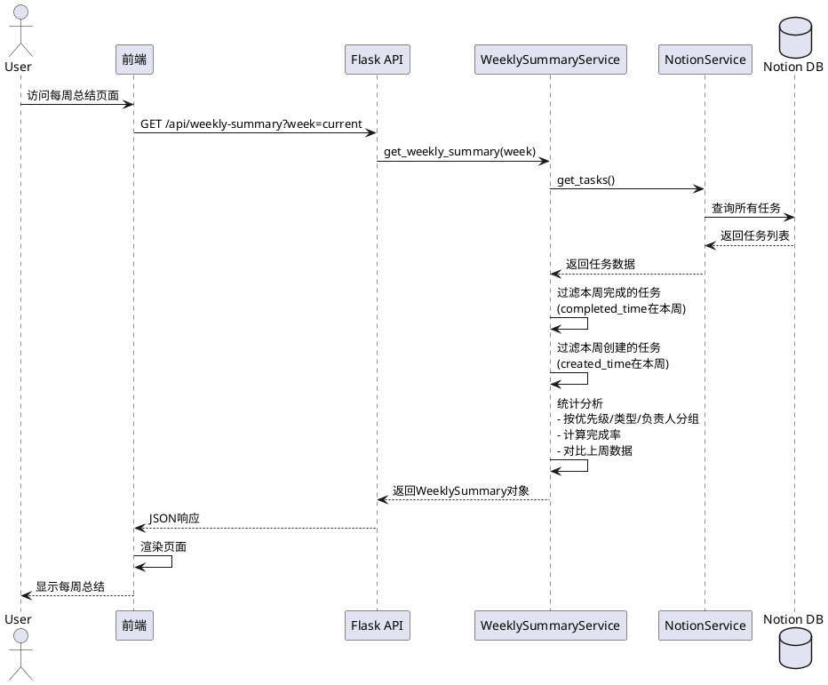
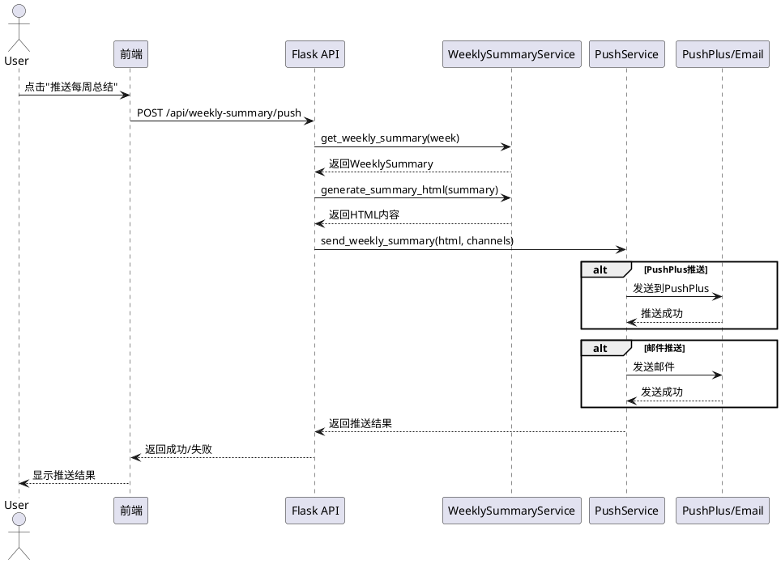
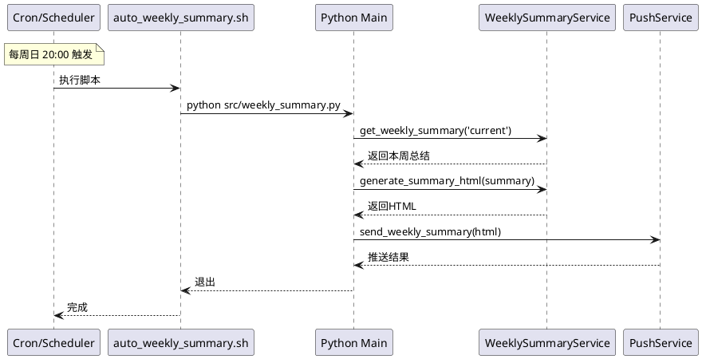

# 每周总结功能设计方案

## 📋 需求分析

### 核心需求
1. **数据统计**：统计每周完成的任务和创建的任务
2. **页面展示**：在Web界面展示每周总结
3. **消息推送**：通过PushPlus/邮件推送每周总结

### 功能范围
- 统计周期：自然周（周一到周日）
- 统计维度：
  - 完成任务数量、类型、优先级分布
  - 创建任务数量、类型、优先级分布
  - 完成率、效率分析
  - 趋势对比（与上周对比）

---

## 🏗️ 系统架构

### 整体架构图

```
┌─────────────────────────────────────────────────────────────┐
│                    前端 (React)                              │
├─────────────────────────────────────────────────────────────┤
│                                                              │
│  ┌──────────────┐  ┌──────────────┐  ┌──────────────┐     │
│  │  每周总结    │  │  统计图表    │  │  推送设置    │     │
│  │  页面组件    │  │  组件        │  │  组件        │     │
│  └──────┬───────┘  └──────┬───────┘  └──────┬───────┘     │
│         │                 │                 │              │
│         └─────────────────┴─────────────────┘              │
│                           │                                 │
│                    ┌──────▼───────┐                        │
│                    │   API 调用    │                        │
│                    └──────┬───────┘                        │
└───────────────────────────┼────────────────────────────────┘
                            │
                    ┌───────▼────────┐
                    │   Flask API    │
                    └───────┬────────┘
                            │
        ┌───────────────────┼───────────────────┐
        │                   │                   │
┌───────▼────────┐  ┌───────▼────────┐  ┌──────▼──────┐
│  Notion        │  │  Weekly        │  │  Push       │
│  Service       │  │  Summary       │  │  Service    │
│                │  │  Service       │  │             │
│ - 获取任务     │  │ - 统计分析     │  │ - PushPlus  │
│ - 过滤数据     │  │ - 生成报告     │  │ - Email     │
└────────────────┘  └────────────────┘  └─────────────┘
```

---

## 📊 数据模型设计

### WeeklySummary 数据结构

```typescript
interface WeeklySummary {
  // 周期信息
  week_start: string        // 周开始日期 (YYYY-MM-DD)
  week_end: string          // 周结束日期 (YYYY-MM-DD)
  week_number: number       // 第几周
  year: number              // 年份
  
  // 完成任务统计
  completed: {
    total: number           // 总完成数
    by_priority: {          // 按优先级
      'P0 重要紧急': number
      'P1 重要不紧急': number
      'P2 紧急不重要': number
      'P3 不重要不紧急': number
    }
    by_type: {              // 按类型
      [key: string]: number
    }
    by_assignee: {          // 按负责人
      [key: string]: number
    }
    tasks: Task[]           // 完成的任务列表
  }
  
  // 创建任务统计
  created: {
    total: number
    by_priority: Record<string, number>
    by_type: Record<string, number>
    by_assignee: Record<string, number>
    tasks: Task[]
  }
  
  // 效率分析
  efficiency: {
    completion_rate: number     // 完成率 (完成/创建)
    avg_completion_time: number // 平均完成时间(天)
    overdue_count: number       // 逾期任务数
  }
  
  // 趋势对比
  trend: {
    completed_change: number    // 完成数变化 (vs上周)
    created_change: number      // 创建数变化 (vs上周)
    efficiency_change: number   // 效率变化 (vs上周)
  }
}
```

---

## 🎨 前端界面设计

### 页面布局 (ASCII)

```
┌────────────────────────────────────────────────────────────────┐
│  📊 每周总结                                    [本周] [上周] ▼ │
├────────────────────────────────────────────────────────────────┤
│                                                                 │
│  📅 2025年第48周 (11月25日 - 12月1日)                          │
│                                                                 │
│  ┌─────────────────┐  ┌─────────────────┐  ┌─────────────────┐│
│  │  ✅ 完成任务     │  │  📝 创建任务     │  │  📈 完成率      ││
│  │                 │  │                 │  │                 ││
│  │      15         │  │      12         │  │     125%        ││
│  │   ↑ +3 (25%)   │  │   ↓ -2 (14%)   │  │   ↑ +15%       ││
│  └─────────────────┘  └─────────────────┘  └─────────────────┘│
│                                                                 │
│  ┌────────────────────────────────────────────────────────────┐│
│  │  📊 任务分布                                                ││
│  ├────────────────────────────────────────────────────────────┤│
│  │                                                             ││
│  │  优先级分布:                                                ││
│  │  🔴 P0: ████████ 8 (53%)                                   ││
│  │  🔵 P1: ████ 4 (27%)                                       ││
│  │  🟠 P2: ██ 2 (13%)                                         ││
│  │  ⚪ P3: █ 1 (7%)                                           ││
│  │                                                             ││
│  │  任务类型:                                                  ││
│  │  💼 工作: ██████ 6 (40%)                                   ││
│  │  📚 个人成长: ████ 4 (27%)                                 ││
│  │  🏠 家庭生活: ███ 3 (20%)                                  ││
│  │  💰 理财投资: ██ 2 (13%)                                   ││
│  │                                                             ││
│  └────────────────────────────────────────────────────────────┘│
│                                                                 │
│  ┌────────────────────────────────────────────────────────────┐│
│  │  📋 本周完成的任务 (15)                                     ││
│  ├────────────────────────────────────────────────────────────┤│
│  │  ✅ 完成项目文档编写          P0  工作      11-28 20:30    ││
│  │  ✅ 学习React Hooks          P1  个人成长   11-29 15:45    ││
│  │  ✅ 修复登录bug              P0  工作      11-30 10:20    ││
│  │  ...                                                        ││
│  └────────────────────────────────────────────────────────────┘│
│                                                                 │
│  ┌────────────────────────────────────────────────────────────┐│
│  │  💡 本周亮点                                                ││
│  ├────────────────────────────────────────────────────────────┤│
│  │  • 完成了8个P0重要紧急任务，效率提升25%                     ││
│  │  • 工作类任务占比最高，达到40%                              ││
│  │  • 平均完成时间2.3天，比上周快0.5天                         ││
│  └────────────────────────────────────────────────────────────┘│
│                                                                 │
│  [📤 推送每周总结]  [📥 导出报告]  [📊 查看详细数据]          │
└────────────────────────────────────────────────────────────────┘
```

### 组件结构

```
WeeklySummaryPage/
├── WeeklySummaryHeader          # 头部（周期选择）
├── WeeklySummaryCards           # 统计卡片
│   ├── CompletedTasksCard      # 完成任务卡片
│   ├── CreatedTasksCard        # 创建任务卡片
│   └── CompletionRateCard      # 完成率卡片
├── TaskDistributionCharts       # 分布图表
│   ├── PriorityChart           # 优先级分布
│   └── TypeChart               # 类型分布
├── TaskListSection              # 任务列表
│   ├── CompletedTasksList      # 完成任务列表
│   └── CreatedTasksList        # 创建任务列表
├── WeeklyHighlights             # 本周亮点
└── WeeklySummaryActions         # 操作按钮
```

---

## 🔄 业务流程设计

### 1. 数据获取流程 (PlantUML)



### 2. 推送流程 (PlantUML)



### 3. 定时推送流程



---

## 💻 技术实现方案

### 后端实现

#### 1. 新增 WeeklySummaryService

```python
# backend/services/weekly_summary_service.py

from datetime import datetime, timedelta
from typing import Dict, List
import pytz
from collections import defaultdict

class WeeklySummaryService:
    def __init__(self, notion_service):
        self.notion_service = notion_service
        self.beijing_tz = pytz.timezone('Asia/Shanghai')
    
    def get_week_range(self, week_offset=0):
        """
        获取周范围（周一到周日）
        week_offset: 0=本周, -1=上周, 1=下周
        """
        now = datetime.now(self.beijing_tz)
        # 获取本周一
        monday = now - timedelta(days=now.weekday())
        # 加上偏移
        monday = monday + timedelta(weeks=week_offset)
        # 设置为当天0点
        monday = monday.replace(hour=0, minute=0, second=0, microsecond=0)
        # 周日23:59:59
        sunday = monday + timedelta(days=6, hours=23, minutes=59, seconds=59)
        
        return monday, sunday
    
    def get_weekly_summary(self, week='current'):
        """
        获取每周总结
        week: 'current', 'last', 或具体日期
        """
        # 确定周范围
        if week == 'current':
            week_start, week_end = self.get_week_range(0)
        elif week == 'last':
            week_start, week_end = self.get_week_range(-1)
        else:
            # 解析具体日期
            date = datetime.strptime(week, '%Y-%m-%d')
            week_start, week_end = self._get_week_from_date(date)
        
        # 获取所有任务
        all_tasks = self.notion_service.get_tasks()
        
        # 过滤本周完成的任务
        completed_tasks = self._filter_completed_tasks(all_tasks, week_start, week_end)
        
        # 过滤本周创建的任务
        created_tasks = self._filter_created_tasks(all_tasks, week_start, week_end)
        
        # 统计分析
        completed_stats = self._analyze_tasks(completed_tasks)
        created_stats = self._analyze_tasks(created_tasks)
        
        # 计算效率指标
        efficiency = self._calculate_efficiency(completed_tasks, created_tasks)
        
        # 对比上周
        last_week_summary = self._get_last_week_summary(week_start)
        trend = self._calculate_trend(completed_stats, created_stats, last_week_summary)
        
        return {
            'week_start': week_start.strftime('%Y-%m-%d'),
            'week_end': week_end.strftime('%Y-%m-%d'),
            'week_number': week_start.isocalendar()[1],
            'year': week_start.year,
            'completed': completed_stats,
            'created': created_stats,
            'efficiency': efficiency,
            'trend': trend
        }
    
    def _filter_completed_tasks(self, tasks, week_start, week_end):
        """过滤本周完成的任务"""
        result = []
        for task in tasks:
            if task.get('status') == '已完成' and task.get('completed_time'):
                completed_time = datetime.fromisoformat(
                    task['completed_time'].replace('Z', '+00:00')
                )
                completed_time = completed_time.astimezone(self.beijing_tz)
                if week_start <= completed_time <= week_end:
                    result.append(task)
        return result
    
    def _filter_created_tasks(self, tasks, week_start, week_end):
        """过滤本周创建的任务"""
        result = []
        for task in tasks:
            if task.get('created_time'):
                created_time = datetime.fromisoformat(
                    task['created_time'].replace('Z', '+00:00')
                )
                created_time = created_time.astimezone(self.beijing_tz)
                if week_start <= created_time <= week_end:
                    result.append(task)
        return result
    
    def _analyze_tasks(self, tasks):
        """分析任务统计"""
        stats = {
            'total': len(tasks),
            'by_priority': defaultdict(int),
            'by_type': defaultdict(int),
            'by_assignee': defaultdict(int),
            'tasks': tasks
        }
        
        for task in tasks:
            stats['by_priority'][task.get('priority', 'P3')] += 1
            stats['by_type'][task.get('task_type', '未分类')] += 1
            stats['by_assignee'][task.get('assignee', '未分配')] += 1
        
        return dict(stats)
    
    def _calculate_efficiency(self, completed, created):
        """计算效率指标"""
        # ... 实现效率计算逻辑
        pass
    
    def _calculate_trend(self, completed, created, last_week):
        """计算趋势对比"""
        # ... 实现趋势对比逻辑
        pass
```

#### 2. 新增 API 端点

```python
# backend/app.py

@app.route('/api/weekly-summary', methods=['GET'])
def get_weekly_summary():
    """获取每周总结"""
    try:
        week = request.args.get('week', 'current')
        summary = weekly_summary_service.get_weekly_summary(week)
        
        return jsonify({
            'success': True,
            'data': summary
        })
    except Exception as e:
        return jsonify({
            'success': False,
            'error': str(e)
        }), 500

@app.route('/api/weekly-summary/push', methods=['POST'])
def push_weekly_summary():
    """推送每周总结"""
    try:
        data = request.get_json()
        week = data.get('week', 'current')
        channels = data.get('channels', ['pushplus'])
        
        # 获取总结
        summary = weekly_summary_service.get_weekly_summary(week)
        
        # 生成HTML
        html = weekly_summary_service.generate_summary_html(summary)
        
        # 推送
        results = push_service.send_weekly_summary(html, channels)
        
        return jsonify({
            'success': True,
            'data': results
        })
    except Exception as e:
        return jsonify({
            'success': False,
            'error': str(e)
        }), 500
```

### 前端实现

#### 1. 新增类型定义

```typescript
// frontend/src/types.ts

export interface WeeklySummary {
  week_start: string
  week_end: string
  week_number: number
  year: number
  completed: TaskStats
  created: TaskStats
  efficiency: EfficiencyMetrics
  trend: TrendMetrics
}

export interface TaskStats {
  total: number
  by_priority: Record<string, number>
  by_type: Record<string, number>
  by_assignee: Record<string, number>
  tasks: Task[]
}

export interface EfficiencyMetrics {
  completion_rate: number
  avg_completion_time: number
  overdue_count: number
}

export interface TrendMetrics {
  completed_change: number
  created_change: number
  efficiency_change: number
}
```

#### 2. 新增 API 调用

```typescript
// frontend/src/api.ts

export const fetchWeeklySummary = async (week: string = 'current'): Promise<WeeklySummary> => {
  const response = await axios.get(`${API_BASE_URL}/weekly-summary`, {
    params: { week }
  })
  return response.data.data
}

export const pushWeeklySummary = async (week: string, channels: string[]): Promise<any> => {
  const response = await axios.post(`${API_BASE_URL}/weekly-summary/push`, {
    week,
    channels
  })
  return response.data
}
```

#### 3. 新增页面组件

```typescript
// frontend/src/components/WeeklySummaryPage.tsx

import { useState, useEffect } from 'react'
import { WeeklySummary } from '../types'
import { fetchWeeklySummary, pushWeeklySummary } from '../api'

const WeeklySummaryPage = () => {
  const [summary, setSummary] = useState<WeeklySummary | null>(null)
  const [selectedWeek, setSelectedWeek] = useState('current')
  const [loading, setLoading] = useState(true)
  
  useEffect(() => {
    loadSummary()
  }, [selectedWeek])
  
  const loadSummary = async () => {
    setLoading(true)
    try {
      const data = await fetchWeeklySummary(selectedWeek)
      setSummary(data)
    } catch (error) {
      console.error('Failed to load summary:', error)
    } finally {
      setLoading(false)
    }
  }
  
  const handlePush = async () => {
    try {
      await pushWeeklySummary(selectedWeek, ['pushplus', 'email'])
      alert('推送成功！')
    } catch (error) {
      alert('推送失败，请重试')
    }
  }
  
  // ... 渲染逻辑
}
```

---

## 📅 实施计划

### 阶段1：后端开发（预计2-3天）
1. ✅ 创建 WeeklySummaryService
2. ✅ 实现数据过滤和统计逻辑
3. ✅ 添加 API 端点
4. ✅ 编写单元测试

### 阶段2：前端开发（预计2-3天）
1. ✅ 创建类型定义
2. ✅ 实现 API 调用
3. ✅ 开发页面组件
4. ✅ 实现图表展示

### 阶段3：推送功能（预计1天）
1. ✅ 生成HTML模板
2. ✅ 集成PushService
3. ✅ 测试推送功能

### 阶段4：定时任务（预计1天）
1. ✅ 创建定时脚本
2. ✅ 配置GitHub Actions
3. ✅ 测试定时执行

### 阶段5：测试和优化（预计1-2天）
1. ✅ 功能测试
2. ✅ 性能优化
3. ✅ 文档编写

---

## 🎯 关键技术点

### 1. 时间范围计算
- 使用 Python datetime 和 pytz 处理时区
- 周一作为一周开始，周日作为结束
- 支持查询历史周数据

### 2. 数据过滤
- 按 completed_time 过滤完成任务
- 按 created_time 过滤创建任务
- 时区统一使用北京时间

### 3. 统计分析
- 使用 defaultdict 简化分组统计
- 计算百分比和趋势变化
- 生成可视化数据

### 4. HTML 模板
- 复用现有的 message_formatter
- 添加图表和进度条
- 响应式设计

---

## ⚠️ 注意事项

1. **时区处理**
   - 所有时间统一转换为北京时间
   - 注意 Notion API 返回的是 UTC 时间

2. **性能优化**
   - 缓存每周总结数据
   - 避免重复查询 Notion API
   - 前端使用分页加载任务列表

3. **错误处理**
   - API 调用失败的降级处理
   - 推送失败的重试机制
   - 用户友好的错误提示

4. **数据一致性**
   - 确保完成时间和创建时间的准确性
   - 处理跨周任务的统计

---

## 📝 待确认事项

请确认以下设计是否符合您的需求：

1. ✅ 统计周期为自然周（周一到周日）
2. ✅ 统计维度包括：优先级、类型、负责人
3. ✅ 推送渠道：PushPlus + 邮件
4. ✅ 定时推送：每周日晚上20:00
5. ✅ 页面位置：新增独立的"每周总结"tab

**如果以上设计方案获得您的同意，我将开始进行代码开发。**
