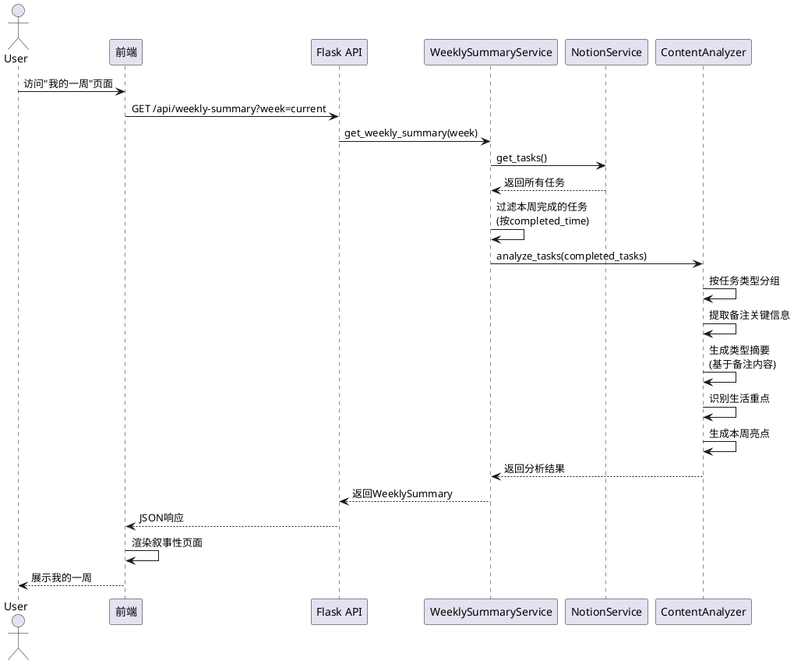
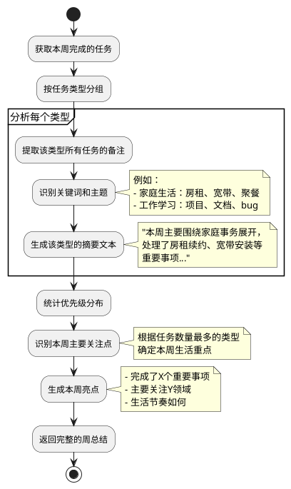

# 每周生活总结功能设计方案 v2.0

## 📋 需求重新理解

### 核心定位
这是一个**个人生活回顾工具**，而非工作效率分析工具。重点在于：
- 📖 **叙事性总结**：通过任务和备注回顾本周生活
- 🎯 **主题提取**：识别本周生活重点（如家庭、学习、理财等）
- 💭 **内容分析**：深度读取备注内容，提取关键事件
- 🌟 **亮点呈现**：展示本周值得记录的生活片段

### 功能范围
- ✅ 统计本周完成的任务（按类型分布）
- ✅ 提取任务备注中的关键信息
- ✅ 生成叙事性的周总结
- ✅ 推送到微信/邮件作为周记
- ❌ 不需要效率分析、完成率等工作指标
- ❌ 不需要创建任务统计（关注完成即可）

---

## 🎨 前端界面设计（重新设计）

### 页面布局 (ASCII)

```
┌────────────────────────────────────────────────────────────────┐
│  📖 我的一周                                    [本周] [上周] ▼ │
├────────────────────────────────────────────────────────────────┤
│                                                                 │
│  📅 2025年第48周 (11月25日 - 12月1日)                          │
│                                                                 │
│  ┌────────────────────────────────────────────────────────────┐│
│  │  🎯 本周生活重点                                            ││
│  ├────────────────────────────────────────────────────────────┤│
│  │                                                             ││
│  │  🏠 家庭生活 (6件事)                                        ││
│  │     本周主要围绕家庭事务展开，处理了房租续约、宽带安装等   ││
│  │     重要事项，并安排了周末的家庭活动。                      ││
│  │                                                             ││
│  │  💼 工作学习 (5件事)                                        ││
│  │     完成了几个重要的工作任务，包括项目文档编写和bug修复。   ││
│  │                                                             ││
│  │  💰 理财投资 (2件事)                                        ││
│  │     关注了本周的投资动态，做了一些理财规划。                ││
│  │                                                             ││
│  │  📚 个人成长 (2件事)                                        ││
│  │     学习了新技术，提升了个人能力。                          ││
│  │                                                             ││
│  └────────────────────────────────────────────────────────────┘│
│                                                                 │
│  ┌────────────────────────────────────────────────────────────┐│
│  │  📊 任务分布 (共完成 15 件事)                               ││
│  ├────────────────────────────────────────────────────────────┤│
│  │                                                             ││
│  │  🏠 家庭生活: ████████████ 6 (40%)                         ││
│  │  💼 工作学习: ██████████ 5 (33%)                           ││
│  │  💰 理财投资: ████ 2 (13%)                                 ││
│  │  📚 个人成长: ████ 2 (13%)                                 ││
│  │                                                             ││
│  └────────────────────────────────────────────────────────────┘│
│                                                                 │
│  ┌────────────────────────────────────────────────────────────┐│
│  │  🏠 家庭生活 (6)                                 [展开详情] ││
│  ├────────────────────────────────────────────────────────────┤│
│  │                                                             ││
│  │  ✅ 房租续约                              P0    11-26 周二  ││
│  │     📝 与房东沟通续约事宜，确认了明年的租金价格，签订了    ││
│  │        新的租赁合同。租金保持不变，续约一年。              ││
│  │                                                             ││
│  │  ✅ 宽带安装                              P0    11-27 周三  ││
│  │     📝 联系了电信公司，预约了宽带安装时间。师傅上门安装，  ││
│  │        测速正常，网络稳定。办理了200M套餐。                ││
│  │                                                             ││
│  │  ✅ 周末家庭聚餐                          P1    11-30 周六  ││
│  │     📝 周六晚上和家人一起去了新开的川菜馆，菜品不错，      ││
│  │        环境也很好。大家聊得很开心。                        ││
│  │                                                             ││
│  │  ✅ 采购生活用品                          P2    11-28 周四  ││
│  │     📝 去超市采购了本周的生活用品和食材，花费约500元。     ││
│  │                                                             ││
│  │  ✅ 整理房间                              P2    11-29 周五  ││
│  │     📝 周五晚上花了2小时整理房间，扔掉了一些不用的东西，   ││
│  │        房间整洁多了。                                      ││
│  │                                                             ││
│  │  ✅ 家电维修                              P1    11-26 周二  ││
│  │     📝 洗衣机出现故障，联系了售后维修，更换了排水管。      ││
│  │                                                             ││
│  └────────────────────────────────────────────────────────────┘│
│                                                                 │
│  ┌────────────────────────────────────────────────────────────┐│
│  │  💼 工作学习 (5)                             [展开详情]     ││
│  ├────────────────────────────────────────────────────────────┤│
│  │  ✅ 完成项目文档编写                      P0    11-28 周四  ││
│  │  ✅ 修复登录bug                          P0    11-30 周六  ││
│  │  ✅ 学习React Hooks                      P1    11-29 周五  ││
│  │  ...                                                        ││
│  └────────────────────────────────────────────────────────────┘│
│                                                                 │
│  ┌────────────────────────────────────────────────────────────┐│
│  │  💡 本周值得记录                                            ││
│  ├────────────────────────────────────────────────────────────┤│
│  │                                                             ││
│  │  🌟 本周是家庭生活的重要一周                                ││
│  │     完成了房租续约和宽带安装两件重要的家庭事务，为未来一年 ││
│  │     的生活打下了基础。周末的家庭聚餐也让大家关系更融洽。   ││
│  │                                                             ││
│  │  🎯 重要事项都按时完成                                      ││
│  │     本周完成的6个P0优先级任务都是家庭和工作的重要事项，     ││
│  │     没有拖延，执行力不错。                                  ││
│  │                                                             ││
│  │  📈 生活节奏平衡                                            ││
│  │     工作、家庭、个人成长都有兼顾，生活比较充实。            ││
│  │                                                             ││
│  └────────────────────────────────────────────────────────────┘│
│                                                                 │
│  [📤 推送周记]  [📥 导出Markdown]  [📊 查看历史周记]          │
└────────────────────────────────────────────────────────────────┘
```

### 关键设计变化

**1. 移除的内容：**
- ❌ 创建任务统计
- ❌ 完成率、效率分析
- ❌ 平均完成时间等工作指标
- ❌ 与上周的数值对比

**2. 新增的内容：**
- ✅ **生活重点摘要**：按任务类型自动生成叙事性描述
- ✅ **备注详情展示**：完整展示每个任务的备注内容
- ✅ **分类折叠展示**：按任务类型分组，可展开/折叠
- ✅ **本周值得记录**：基于数据自动生成的生活感悟

---

## 📊 数据模型设计（重新设计）

### WeeklySummary 数据结构

```typescript
interface WeeklySummary {
  // 周期信息
  week_start: string        // 周开始日期
  week_end: string          // 周结束日期
  week_number: number       // 第几周
  year: number              // 年份
  
  // 完成任务统计（只统计完成，不统计创建）
  completed: {
    total: number           // 总完成数
    by_type: {              // 按类型分组
      [type: string]: {
        count: number       // 数量
        tasks: Task[]       // 任务列表（含完整备注）
        summary: string     // 该类型的AI生成摘要
      }
    }
    by_priority: {          // 按优先级统计（用于生成亮点）
      'P0 重要紧急': number
      'P1 重要不紧急': number
      'P2 紧急不重要': number
      'P3 不重要不紧急': number
    }
  }
  
  // 生活重点（AI生成）
  highlights: {
    main_focus: string      // 本周主要关注点（如"家庭生活"）
    key_events: string[]    // 关键事件列表
    insights: string[]      // 生活感悟
  }
}
```

---

## 🔄 业务流程设计

### 1. 数据获取与分析流程



### 2. 内容分析逻辑



---

## 💻 技术实现方案

### 后端实现

#### 1. WeeklySummaryService（重新设计）

```python
# backend/services/weekly_summary_service.py

from datetime import datetime, timedelta
from typing import Dict, List
import pytz
from collections import defaultdict
import re

class WeeklySummaryService:
    def __init__(self, notion_service):
        self.notion_service = notion_service
        self.beijing_tz = pytz.timezone('Asia/Shanghai')
    
    def get_weekly_summary(self, week='current'):
        """获取每周生活总结"""
        # 确定周范围
        week_start, week_end = self._get_week_range(week)
        
        # 获取所有任务
        all_tasks = self.notion_service.get_tasks()
        
        # 过滤本周完成的任务
        completed_tasks = self._filter_completed_tasks(all_tasks, week_start, week_end)
        
        # 按类型分组并分析
        by_type = self._group_and_analyze_by_type(completed_tasks)
        
        # 统计优先级
        by_priority = self._count_by_priority(completed_tasks)
        
        # 生成生活重点和亮点
        highlights = self._generate_highlights(completed_tasks, by_type, by_priority)
        
        return {
            'week_start': week_start.strftime('%Y-%m-%d'),
            'week_end': week_end.strftime('%Y-%m-%d'),
            'week_number': week_start.isocalendar()[1],
            'year': week_start.year,
            'completed': {
                'total': len(completed_tasks),
                'by_type': by_type,
                'by_priority': by_priority
            },
            'highlights': highlights
        }
    
    def _group_and_analyze_by_type(self, tasks):
        """按类型分组并分析内容"""
        grouped = defaultdict(list)
        
        for task in tasks:
            task_type = task.get('task_type', '未分类')
            grouped[task_type].append(task)
        
        result = {}
        for task_type, type_tasks in grouped.items():
            # 提取所有备注
            notes = [t.get('notes', '') for t in type_tasks if t.get('notes')]
            
            # 生成该类型的摘要
            summary = self._generate_type_summary(task_type, type_tasks, notes)
            
            result[task_type] = {
                'count': len(type_tasks),
                'tasks': type_tasks,
                'summary': summary
            }
        
        return result
    
    def _generate_type_summary(self, task_type, tasks, notes):
        """生成某个类型的摘要文本"""
        count = len(tasks)
        
        # 提取关键词（从任务名称和备注中）
        keywords = self._extract_keywords(tasks, notes)
        
        # 根据类型生成不同的摘要模板
        templates = {
            '家庭生活': f'本周主要围绕家庭事务展开，处理了{", ".join(keywords[:3])}等重要事项。',
            '工作学习': f'完成了{count}个工作任务，包括{", ".join(keywords[:3])}。',
            '理财投资': f'关注了本周的投资动态，{", ".join(keywords[:2])}。',
            '个人成长': f'在个人提升方面，{", ".join(keywords[:2])}。',
        }
        
        return templates.get(task_type, f'完成了{count}件{task_type}相关的事情。')
    
    def _extract_keywords(self, tasks, notes):
        """从任务名称和备注中提取关键词"""
        keywords = []
        
        # 从任务名称提取
        for task in tasks:
            name = task.get('name', '')
            # 简单提取（可以后续优化为NLP分词）
            if len(name) < 20:
                keywords.append(name)
        
        # 从备注中提取关键短语（简化版）
        for note in notes:
            if note:
                # 提取前20个字作为关键信息
                key_phrase = note[:20] + '...' if len(note) > 20 else note
                keywords.append(key_phrase)
        
        return keywords[:5]  # 返回前5个关键词
    
    def _generate_highlights(self, tasks, by_type, by_priority):
        """生成本周亮点"""
        # 找出任务最多的类型（主要关注点）
        main_type = max(by_type.items(), key=lambda x: x[1]['count'])[0] if by_type else '生活'
        
        # 统计P0任务数量
        p0_count = by_priority.get('P0 重要紧急', 0)
        
        insights = []
        
        # 生成亮点1：主要关注点
        insights.append(f'本周是{main_type}的重要一周，完成了{by_type[main_type]["count"]}件相关事务。')
        
        # 生成亮点2：重要事项完成情况
        if p0_count > 0:
            insights.append(f'完成了{p0_count}个重要紧急任务，执行力不错。')
        
        # 生成亮点3：生活平衡
        type_count = len(by_type)
        if type_count >= 3:
            insights.append(f'涉及{type_count}个生活领域，生活比较充实平衡。')
        
        return {
            'main_focus': main_type,
            'key_events': [t['name'] for t in tasks[:5]],  # 前5个任务
            'insights': insights
        }
    
    def _filter_completed_tasks(self, tasks, week_start, week_end):
        """过滤本周完成的任务"""
        result = []
        for task in tasks:
            if task.get('status') == '已完成' and task.get('completed_time'):
                completed_time = datetime.fromisoformat(
                    task['completed_time'].replace('Z', '+00:00')
                )
                completed_time = completed_time.astimezone(self.beijing_tz)
                if week_start <= completed_time <= week_end:
                    result.append(task)
        return result
    
    def _count_by_priority(self, tasks):
        """统计优先级分布"""
        priority_count = defaultdict(int)
        for task in tasks:
            priority = task.get('priority', 'P3 不重要不紧急')
            priority_count[priority] += 1
        return dict(priority_count)
    
    def _get_week_range(self, week):
        """获取周范围"""
        if week == 'current':
            now = datetime.now(self.beijing_tz)
            monday = now - timedelta(days=now.weekday())
        elif week == 'last':
            now = datetime.now(self.beijing_tz)
            monday = now - timedelta(days=now.weekday() + 7)
        else:
            # 解析具体日期
            date = datetime.strptime(week, '%Y-%m-%d')
            date = self.beijing_tz.localize(date)
            monday = date - timedelta(days=date.weekday())
        
        monday = monday.replace(hour=0, minute=0, second=0, microsecond=0)
        sunday = monday + timedelta(days=6, hours=23, minutes=59, seconds=59)
        
        return monday, sunday
```

#### 2. 生成推送HTML

```python
def generate_weekly_html(self, summary):
    """生成周记HTML（用于推送）"""
    week_str = f"{summary['year']}年第{summary['week_number']}周"
    date_range = f"{summary['week_start']} - {summary['week_end']}"
    
    html = f"""
    <div style="font-family: Arial, sans-serif; max-width: 800px; margin: 0 auto;">
        <h1 style="color: #333;">📖 我的一周</h1>
        <p style="color: #666;">{week_str} ({date_range})</p>
        
        <div style="background: #f5f5f5; padding: 20px; border-radius: 8px; margin: 20px 0;">
            <h2 style="color: #555;">🎯 本周生活重点</h2>
            <p><strong>{summary['highlights']['main_focus']}</strong> ({summary['completed']['by_type'][summary['highlights']['main_focus']]['count']}件事)</p>
            <p>{summary['completed']['by_type'][summary['highlights']['main_focus']]['summary']}</p>
        </div>
        
        <div style="margin: 20px 0;">
            <h2 style="color: #555;">📊 任务分布 (共完成 {summary['completed']['total']} 件事)</h2>
    """
    
    # 按类型展示
    for task_type, data in summary['completed']['by_type'].items():
        percentage = (data['count'] / summary['completed']['total'] * 100)
        html += f"""
        <div style="margin: 15px 0;">
            <h3 style="color: #333;">{self._get_type_icon(task_type)} {task_type} ({data['count']})</h3>
            <div style="background: #e0e0e0; height: 20px; border-radius: 10px; overflow: hidden;">
                <div style="background: {self._get_type_color(task_type)}; width: {percentage}%; height: 100%;"></div>
            </div>
        """
        
        # 展示该类型的任务
        for task in data['tasks']:
            completed_date = datetime.fromisoformat(task['completed_time'].replace('Z', '+00:00'))
            date_str = completed_date.strftime('%m-%d %A')
            
            html += f"""
            <div style="margin: 10px 0; padding: 10px; background: #fff; border-left: 3px solid {self._get_type_color(task_type)};">
                <p style="margin: 5px 0;"><strong>✅ {task['name']}</strong> <span style="color: #999;">{task['priority']} {date_str}</span></p>
            """
            
            if task.get('notes'):
                html += f"""
                <p style="margin: 5px 0; color: #666; font-size: 14px;">📝 {task['notes']}</p>
                """
            
            html += "</div>"
        
        html += "</div>"
    
    # 本周亮点
    html += f"""
        <div style="background: #fff3cd; padding: 20px; border-radius: 8px; margin: 20px 0;">
            <h2 style="color: #856404;">💡 本周值得记录</h2>
    """
    
    for insight in summary['highlights']['insights']:
        html += f"<p style="color: #856404;">🌟 {insight}</p>"
    
    html += """
        </div>
    </div>
    """
    
    return html

def _get_type_icon(self, task_type):
    """获取类型图标"""
    icons = {
        '家庭生活': '🏠',
        '工作学习': '💼',
        '理财投资': '💰',
        '个人成长': '📚',
        '健康运动': '💪',
    }
    return icons.get(task_type, '📌')

def _get_type_color(self, task_type):
    """获取类型颜色"""
    colors = {
        '家庭生活': '#4CAF50',
        '工作学习': '#2196F3',
        '理财投资': '#FF9800',
        '个人成长': '#9C27B0',
        '健康运动': '#F44336',
    }
    return colors.get(task_type, '#757575')
```

---

## 🎨 前端实现

### 组件结构（重新设计）

```
WeeklySummaryPage/
├── WeeklySummaryHeader          # 头部（周期选择）
├── WeeklyFocusSection           # 🆕 生活重点区域
│   └── FocusSummaryCard        # 各类型的摘要卡片
├── TaskDistributionChart        # 任务分布图表
├── TasksByTypeSection           # 🆕 按类型分组的任务列表
│   ├── TypeTaskGroup           # 可折叠的类型分组
│   │   ├── TaskItem            # 任务项（含完整备注）
│   │   └── TaskNotes           # 🆕 备注详情展示
├── WeeklyHighlights             # 本周值得记录
└── WeeklySummaryActions         # 操作按钮
```

### 关键组件实现

```typescript
// TasksByTypeSection.tsx
const TasksByTypeSection = ({ byType }: { byType: Record<string, TypeData> }) => {
  const [expandedTypes, setExpandedTypes] = useState<string[]>([])
  
  const toggleType = (type: string) => {
    setExpandedTypes(prev => 
      prev.includes(type) 
        ? prev.filter(t => t !== type)
        : [...prev, type]
    )
  }
  
  return (
    <div className="space-y-4">
      {Object.entries(byType).map(([type, data]) => (
        <div key={type} className="border rounded-lg">
          <div 
            className="flex items-center justify-between p-4 cursor-pointer hover:bg-gray-50"
            onClick={() => toggleType(type)}
          >
            <div className="flex items-center gap-2">
              <span className="text-2xl">{getTypeIcon(type)}</span>
              <h3 className="font-semibold">{type}</h3>
              <span className="text-gray-500">({data.count})</span>
            </div>
            <button className="text-sm text-blue-600">
              {expandedTypes.includes(type) ? '收起' : '展开详情'}
            </button>
          </div>
          
          {expandedTypes.includes(type) && (
            <div className="p-4 bg-gray-50 space-y-3">
              {data.tasks.map(task => (
                <div key={task.id} className="bg-white p-3 rounded border-l-4" 
                     style={{ borderColor: getTypeColor(type) }}>
                  <div className="flex items-center justify-between mb-2">
                    <span className="font-medium">✅ {task.name}</span>
                    <span className="text-sm text-gray-500">
                      {task.priority} {formatDate(task.completed_time)}
                    </span>
                  </div>
                  
                  {/* 🆕 备注详情展示 */}
                  {task.notes && (
                    <div className="mt-2 p-3 bg-gray-50 rounded text-sm text-gray-700">
                      <span className="text-gray-500">📝 </span>
                      {task.notes}
                    </div>
                  )}
                </div>
              ))}
            </div>
          )}
        </div>
      ))}
    </div>
  )
}
```

---

## 📅 实施计划

### 阶段1：后端开发（2天）
1. ✅ 重构 WeeklySummaryService
2. ✅ 实现内容分析逻辑
3. ✅ 生成叙事性摘要
4. ✅ 添加 API 端点

### 阶段2：前端开发（2天）
1. ✅ 重新设计页面布局
2. ✅ 实现分类折叠展示
3. ✅ 完整展示备注内容
4. ✅ 实现生活重点区域

### 阶段3：推送功能（1天）
1. ✅ 生成周记HTML模板
2. ✅ 集成推送服务
3. ✅ 测试推送效果

### 阶段4：测试优化（1天）
1. ✅ 功能测试
2. ✅ 内容展示优化
3. ✅ 文档编写

---

## 🎯 核心差异总结

### 与v1.0的主要区别

| 维度 | v1.0 (工作效率) | v2.0 (生活总结) |
|------|----------------|----------------|
| **定位** | 任务管理工具 | 生活回顾工具 |
| **统计内容** | 完成+创建任务 | 仅完成任务 |
| **关键指标** | 效率、完成率 | 生活重点、亮点 |
| **备注处理** | 不展示 | **完整展示** |
| **呈现方式** | 数据化 | **叙事化** |
| **分析重点** | 工作效率 | **生活内容** |
| **推送内容** | 统计报表 | **周记形式** |

---

## ✅ 待确认事项

请确认以下设计是否符合您的需求：

1. ✅ 只统计完成的任务，不统计创建的任务
2. ✅ 完整展示每个任务的备注内容
3. ✅ 按任务类型分组，生成叙事性摘要
4. ✅ 生成"本周值得记录"的生活感悟
5. ✅ 推送内容为周记形式，而非数据报表
6. ✅ 移除所有效率、完成率等工作指标

**如果以上设计方案获得您的同意，我将开始进行代码开发。**
