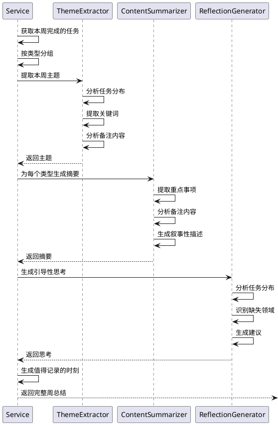

# 每周生活总结功能设计方案 v3.0 (最终版)

## 📋 核心定位

**这是一个智能的个人生活回顾与引导工具**

### 设计理念
- 📖 **智能总结**：基于任务和备注，自动生成周总结
- 🎯 **主题提取**：识别本周生活主题（而非简单分类统计）
- 💭 **引导思考**：提供后续规划建议和反思问题
- 🌟 **人性化呈现**：像朋友聊天一样的温暖表达

### 核心价值
不是简单的任务列表，而是：
- 帮你回顾本周做了什么
- 告诉你本周的生活重心在哪里
- 引导你思考下周可以如何改进

---

## 🎨 界面设计（最终版）

```
┌────────────────────────────────────────────────────────────────┐
│  📖 我的一周                                    [本周] [上周] ▼ │
├────────────────────────────────────────────────────────────────┤
│                                                                 │
│  📅 2025年第48周 (11月25日 - 12月1日)                          │
│                                                                 │
│  ┌────────────────────────────────────────────────────────────┐│
│  │  🎯 本周主题：安定生活，稳固基础                            ││
│  ├────────────────────────────────────────────────────────────┤│
│  │                                                             ││
│  │  这一周，你的生活重心主要围绕"家庭生活"展开。完成了房租   ││
│  │  续约、宽带安装等重要的生活基础设施事项，为未来一年的稳定 ││
│  │  生活打下了基础。同时，你也在工作和个人成长上保持了投入， ││
│  │  展现出了较好的生活平衡能力。                              ││
│  │                                                             ││
│  └────────────────────────────────────────────────────────────┘│
│                                                                 │
│  ┌────────────────────────────────────────────────────────────┐│
│  │  📊 本周完成概览 (共 15 件事)                               ││
│  ├────────────────────────────────────────────────────────────┤│
│  │                                                             ││
│  │  🏠 家庭生活 (6件) - 40%                                    ││
│  │  ████████████████████                                       ││
│  │  重点事项：房租续约、宽带安装、家庭聚餐                     ││
│  │  你完成了多项家庭基础设施的建设，包括与房东确认续约、      ││
│  │  安装新宽带等。周末还安排了家庭聚餐，增进了家人感情。      ││
│  │                                                             ││
│  │  💼 工作学习 (5件) - 33%                                    ││
│  │  ████████████████                                           ││
│  │  重点事项：项目文档、代码优化、技术学习                     ││
│  │  工作上保持了稳定的产出，完成了重要的项目文档编写，        ││
│  │  修复了几个关键bug，同时还抽时间学习了新技术。             ││
│  │                                                             ││
│  │  💰 理财投资 (2件) - 13%                                    ││
│  │  ██████                                                     ││
│  │  重点事项：投资组合调整、理财规划                           ││
│  │  关注了市场动态，对投资组合进行了小幅调整。                ││
│  │                                                             ││
│  │  📚 个人成长 (2件) - 13%                                    ││
│  │  ██████                                                     ││
│  │  重点事项：阅读、技能学习                                   ││
│  │  在个人提升方面保持了学习习惯。                            ││
│  │                                                             ││
│  └────────────────────────────────────────────────────────────┘│
│                                                                 │
│  ┌────────────────────────────────────────────────────────────┐│
│  │  💡 值得记录的时刻                                          ││
│  ├────────────────────────────────────────────────────────────┤│
│  │                                                             ││
│  │  🌟 生活基础更稳固了                                        ││
│  │     完成了房租续约和宽带安装，这些看似琐碎的事情，其实是   ││
│  │     生活稳定的基石。有了这些保障，你可以更安心地投入到     ││
│  │     其他重要的事情上。                                      ││
│  │                                                             ││
│  │  🎯 执行力值得肯定                                          ││
│  │     本周完成了8个P0重要紧急任务，没有拖延，说明你的执行力  ││
│  │     和时间管理能力都不错。继续保持这种状态！                ││
│  │                                                             ││
│  │  ⚖️ 生活比较平衡                                            ││
│  │     虽然家庭事务占据了较多时间，但你也没有忽视工作和个人   ││
│  │     成长，这种平衡感很重要。                                ││
│  │                                                             ││
│  └────────────────────────────────────────────────────────────┘│
│                                                                 │
│  ┌────────────────────────────────────────────────────────────┐│
│  │  🤔 一些思考                                                ││
│  ├────────────────────────────────────────────────────────────┤│
│  │                                                             ││
│  │  💭 下周可以考虑：                                          ││
│  │     • 家庭事务已经稳定，是否可以在个人成长上投入更多时间？ ││
│  │     • 工作上的技术学习可以继续深入，形成系统性的提升       ││
│  │     • 理财投资方面，可以考虑制定更长期的规划               ││
│  │                                                             ││
│  │  📌 需要关注：                                              ││
│  │     • 个人成长类任务占比较少(13%)，可能需要更多投入        ││
│  │     • 健康运动类任务本周为0，下周可以安排一些运动计划      ││
│  │                                                             ││
│  └────────────────────────────────────────────────────────────┘│
│                                                                 │
│  ┌────────────────────────────────────────────────────────────┐│
│  │  📋 本周任务清单 (可展开查看)                    [展开 ▼]  ││
│  └────────────────────────────────────────────────────────────┘│
│                                                                 │
│  [📤 推送周记]  [📥 导出Markdown]  [📊 查看详细数据]          │
└────────────────────────────────────────────────────────────────┘
```

---

## 🎯 核心功能设计

### 1. 本周主题自动提取 ⭐

**不是简单的任务类型统计，而是智能分析：**

```python
def extract_weekly_theme(self, tasks, by_type):
    """
    提取本周主题
    
    分析维度：
    1. 任务类型分布（找出主要领域）
    2. 任务名称关键词（提取核心主题）
    3. 备注内容分析（理解深层含义）
    4. 优先级分布（判断重要程度）
    
    输出：
    - 主题标题（如"安定生活，稳固基础"）
    - 主题描述（叙事性的总结）
    """
    
    # 1. 找出主要任务类型
    main_type = max(by_type.items(), key=lambda x: x[1]['count'])[0]
    
    # 2. 提取关键词
    keywords = self._extract_keywords_from_tasks(tasks)
    
    # 3. 分析备注内容
    notes_summary = self._analyze_notes_content(tasks)
    
    # 4. 生成主题
    theme = self._generate_theme(main_type, keywords, notes_summary)
    
    return theme

# 示例输出：
{
    'title': '安定生活，稳固基础',
    'description': '这一周，你的生活重心主要围绕"家庭生活"展开。完成了房租续约、宽带安装等重要的生活基础设施事项，为未来一年的稳定生活打下了基础。同时，你也在工作和个人成长上保持了投入，展现出了较好的生活平衡能力。'
}
```

### 2. 智能内容摘要 📝

**基于备注生成摘要，而非完整展示：**

```python
def generate_type_summary(self, task_type, tasks):
    """
    为每个任务类型生成智能摘要
    
    输入：某个类型的所有任务（含备注）
    输出：
    - 重点事项（3-5个关键词）
    - 叙事性描述（基于备注内容的总结）
    """
    
    # 1. 提取重点事项（从任务名称）
    key_items = [task['name'] for task in tasks[:3]]
    
    # 2. 分析备注内容
    notes = [t.get('notes', '') for t in tasks if t.get('notes')]
    
    # 3. 生成摘要
    summary = self._summarize_notes(task_type, key_items, notes)
    
    return {
        'key_items': key_items,
        'summary': summary
    }

# 示例输出：
{
    'key_items': ['房租续约', '宽带安装', '家庭聚餐'],
    'summary': '你完成了多项家庭基础设施的建设，包括与房东确认续约、安装新宽带等。周末还安排了家庭聚餐，增进了家人感情。'
}
```

### 3. 引导性思考 💭

**提供后续规划建议：**

```python
def generate_reflections(self, tasks, by_type, by_priority):
    """
    生成引导性思考
    
    分析：
    1. 任务分布是否平衡
    2. 是否有被忽视的领域
    3. 优先级处理是否合理
    4. 可以改进的方向
    
    输出：
    - 下周建议（3-5条）
    - 需要关注的点（2-3条）
    """
    
    reflections = {
        'suggestions': [],  # 下周可以考虑
        'concerns': []      # 需要关注
    }
    
    # 1. 分析任务分布
    total = sum(data['count'] for data in by_type.values())
    
    # 找出占比过低的类型
    for task_type, data in by_type.items():
        percentage = data['count'] / total * 100
        if percentage < 10:
            reflections['concerns'].append(
                f"{task_type}类任务占比较少({percentage:.0f}%)，可能需要更多投入"
            )
    
    # 2. 检查缺失的类型
    all_types = ['家庭生活', '工作学习', '理财投资', '个人成长', '健康运动']
    missing_types = [t for t in all_types if t not in by_type]
    
    for missing in missing_types:
        reflections['concerns'].append(
            f"{missing}类任务本周为0，下周可以安排一些相关计划"
        )
    
    # 3. 基于主要类型给建议
    main_type = max(by_type.items(), key=lambda x: x[1]['count'])[0]
    
    if main_type == '家庭生活':
        reflections['suggestions'].append(
            "家庭事务已经稳定，是否可以在个人成长上投入更多时间？"
        )
    elif main_type == '工作学习':
        reflections['suggestions'].append(
            "工作投入较多，记得平衡生活，安排一些放松活动"
        )
    
    # 4. 基于优先级给建议
    p0_count = by_priority.get('P0 重要紧急', 0)
    if p0_count > 5:
        reflections['suggestions'].append(
            "P0任务较多，考虑提前规划，减少紧急情况的发生"
        )
    
    return reflections

# 示例输出：
{
    'suggestions': [
        '家庭事务已经稳定，是否可以在个人成长上投入更多时间？',
        '工作上的技术学习可以继续深入，形成系统性的提升',
        '理财投资方面，可以考虑制定更长期的规划'
    ],
    'concerns': [
        '个人成长类任务占比较少(13%)，可能需要更多投入',
        '健康运动类任务本周为0，下周可以安排一些运动计划'
    ]
}
```

### 4. 值得记录的时刻 🌟

**人性化的亮点呈现：**

```python
def generate_highlights(self, tasks, by_type, by_priority, theme):
    """
    生成值得记录的时刻
    
    特点：
    - 不是冰冷的数据
    - 而是温暖的鼓励和肯定
    - 帮助用户看到自己的进步
    """
    
    highlights = []
    
    # 1. 基于主题生成亮点
    main_type = max(by_type.items(), key=lambda x: x[1]['count'])[0]
    
    if main_type == '家庭生活':
        highlights.append({
            'title': '生活基础更稳固了',
            'content': '完成了房租续约和宽带安装，这些看似琐碎的事情，其实是生活稳定的基石。有了这些保障，你可以更安心地投入到其他重要的事情上。'
        })
    
    # 2. 基于执行力
    p0_count = by_priority.get('P0 重要紧急', 0)
    if p0_count > 5:
        highlights.append({
            'title': '执行力值得肯定',
            'content': f'本周完成了{p0_count}个P0重要紧急任务，没有拖延，说明你的执行力和时间管理能力都不错。继续保持这种状态！'
        })
    
    # 3. 基于平衡性
    type_count = len(by_type)
    if type_count >= 3:
        highlights.append({
            'title': '生活比较平衡',
            'content': f'虽然{main_type}占据了较多时间，但你也没有忽视其他领域，这种平衡感很重要。'
        })
    
    return highlights
```

---

## 📊 数据模型（最终版）

```typescript
interface WeeklySummary {
  // 周期信息
  week_start: string
  week_end: string
  week_number: number
  year: number
  
  // 本周主题（智能提取）
  theme: {
    title: string           // "安定生活，稳固基础"
    description: string     // 叙事性描述
  }
  
  // 完成任务概览
  completed: {
    total: number
    by_type: {
      [type: string]: {
        count: number
        percentage: number
        key_items: string[]     // 重点事项（3-5个）
        summary: string         // 智能摘要（基于备注）
      }
    }
    by_priority: Record<string, number>
  }
  
  // 值得记录的时刻
  highlights: Array<{
    title: string             // "生活基础更稳固了"
    content: string           // 详细描述
  }>
  
  // 引导性思考
  reflections: {
    suggestions: string[]     // 下周可以考虑
    concerns: string[]        // 需要关注
  }
  
  // 任务列表（折叠，可选展开）
  tasks: Task[]
}
```

---

## 🔄 业务流程（更新）



---

## 💻 核心实现代码

### ThemeExtractor（主题提取器）

```python
class ThemeExtractor:
    """本周主题提取器"""
    
    def extract_theme(self, tasks, by_type):
        """提取本周主题"""
        # 1. 找出主要领域
        main_type = max(by_type.items(), key=lambda x: x[1]['count'])[0]
        main_count = by_type[main_type]['count']
        
        # 2. 提取关键词
        keywords = self._extract_keywords(tasks)
        
        # 3. 生成主题标题
        title = self._generate_title(main_type, keywords)
        
        # 4. 生成主题描述
        description = self._generate_description(main_type, main_count, keywords, by_type)
        
        return {
            'title': title,
            'description': description
        }
    
    def _generate_title(self, main_type, keywords):
        """生成主题标题"""
        # 基于主要类型和关键词生成标题
        title_templates = {
            '家庭生活': ['安定生活，稳固基础', '家的温暖，生活的根基', '经营家庭，享受生活'],
            '工作学习': ['专注成长，稳步前进', '学习精进，不断突破', '工作充实，收获满满'],
            '理财投资': ['理性投资，稳健增长', '财富规划，未来可期', '投资自己，投资未来'],
            '个人成长': ['自我提升，持续进化', '学习成长，遇见更好的自己', '精进不止，成长不息'],
            '健康运动': ['健康生活，活力满满', '运动健身，强健体魄', '关爱自己，健康第一']
        }
        
        templates = title_templates.get(main_type, ['充实的一周'])
        
        # 可以基于关键词进一步优化选择
        return templates[0]
    
    def _generate_description(self, main_type, main_count, keywords, by_type):
        """生成主题描述"""
        # 构建叙事性描述
        desc = f"这一周，你的生活重心主要围绕"{main_type}"展开。"
        
        # 添加具体内容
        if keywords:
            desc += f"完成了{', '.join(keywords[:3])}等重要事项，"
        
        # 添加意义解读
        if main_type == '家庭生活':
            desc += "为未来一年的稳定生活打下了基础。"
        elif main_type == '工作学习':
            desc += "在专业能力上有了新的提升。"
        elif main_type == '理财投资':
            desc += "在财富管理上更加成熟。"
        elif main_type == '个人成长':
            desc += "在自我提升的道路上又前进了一步。"
        
        # 添加平衡性评价
        if len(by_type) >= 3:
            desc += "同时，你也在其他领域保持了投入，展现出了较好的生活平衡能力。"
        
        return desc
```

### ContentSummarizer（内容摘要器）

```python
class ContentSummarizer:
    """内容摘要生成器"""
    
    def summarize_type(self, task_type, tasks):
        """为某个类型生成摘要"""
        # 1. 提取重点事项
        key_items = [task['name'] for task in tasks[:3]]
        
        # 2. 收集备注
        notes = [t.get('notes', '') for t in tasks if t.get('notes')]
        
        # 3. 生成摘要
        summary = self._generate_summary(task_type, key_items, notes)
        
        return {
            'key_items': key_items,
            'summary': summary
        }
    
    def _generate_summary(self, task_type, key_items, notes):
        """生成叙事性摘要"""
        # 基于任务类型使用不同的模板
        if task_type == '家庭生活':
            return self._summarize_family(key_items, notes)
        elif task_type == '工作学习':
            return self._summarize_work(key_items, notes)
        elif task_type == '理财投资':
            return self._summarize_finance(key_items, notes)
        elif task_type == '个人成长':
            return self._summarize_growth(key_items, notes)
        else:
            return f"完成了{', '.join(key_items)}等事项。"
    
    def _summarize_family(self, key_items, notes):
        """家庭生活摘要"""
        summary = "你完成了多项家庭事务，"
        
        # 分析备注内容，提取关键信息
        if any('续约' in note or '租' in note for note in notes):
            summary += "包括处理了房屋相关的重要事项，"
        
        if any('安装' in note or '维修' in note for note in notes):
            summary += "完成了家庭设施的建设和维护，"
        
        if any('聚餐' in note or '家人' in note for note in notes):
            summary += "还安排了家庭活动，增进了家人感情。"
        else:
            summary += "为家庭生活的稳定打下了基础。"
        
        return summary
    
    def _summarize_work(self, key_items, notes):
        """工作学习摘要"""
        summary = "工作上保持了稳定的产出，"
        
        if any('文档' in note or '设计' in note for note in notes):
            summary += "完成了重要的文档和设计工作，"
        
        if any('bug' in note.lower() or '修复' in note for note in notes):
            summary += "修复了几个关键问题，"
        
        if any('学习' in note or '技术' in note for note in notes):
            summary += "同时还抽时间学习了新技术。"
        else:
            summary += "展现了良好的专业能力。"
        
        return summary
```

---

## 📅 实施计划（优化）

### 阶段1：后端核心开发（2-3天）
1. ✅ 实现 ThemeExtractor（主题提取器）
2. ✅ 实现 ContentSummarizer（内容摘要器）
3. ✅ 实现 ReflectionGenerator（思考生成器）
4. ✅ 集成到 WeeklySummaryService

### 阶段2：前端界面开发（2天）
1. ✅ 实现主题展示区域
2. ✅ 实现智能摘要展示
3. ✅ 实现引导性思考区域
4. ✅ 任务列表折叠功能

### 阶段3：推送功能（1天）
1. ✅ 生成周记HTML模板
2. ✅ 测试推送效果

### 阶段4：测试优化（1天）
1. ✅ 功能测试
2. ✅ 内容质量优化
3. ✅ 用户体验优化

---

## ✅ 核心特性总结

### v3.0 vs v2.0 的关键区别

| 特性 | v2.0 | v3.0 (最终版) |
|------|------|--------------|
| **备注展示** | 完整展示每个任务备注 | ❌ 不展示，生成智能摘要 |
| **主题提取** | 简单的任务类型统计 | ✅ 智能主题提取 + 叙事性描述 |
| **内容呈现** | 数据罗列 | ✅ 人性化的故事叙述 |
| **引导功能** | 无 | ✅ 提供下周建议和反思 |
| **亮点呈现** | 简单统计 | ✅ 温暖的鼓励和肯定 |
| **任务列表** | 完整展示 | ✅ 折叠，可选展开 |

### 核心价值

1. **智能分析**：不是简单展示数据，而是理解你的生活
2. **人性化表达**：像朋友一样温暖的语言
3. **引导思考**：帮助你反思和规划
4. **简洁高效**：重点突出，避免信息过载

---

## 🎯 最终确认

请确认以下设计：

1. ✅ **不完整展示备注**，而是生成智能摘要
2. ✅ **本周主题自动提取**（而非简单分类）
3. ✅ **叙事性的内容呈现**（像周记一样）
4. ✅ **引导性思考**（下周建议 + 需要关注）
5. ✅ **人性化的亮点呈现**（温暖的鼓励）
6. ✅ **任务列表折叠**（避免冗余）

**如果您同意此最终设计方案，请回复"同意"或"确认"，我将立即开始代码开发！**
